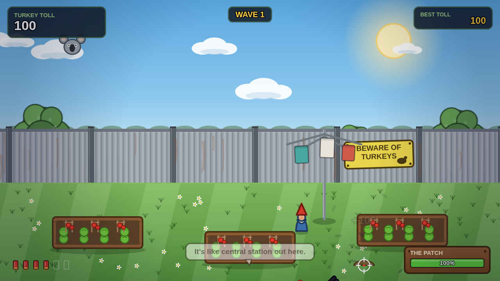
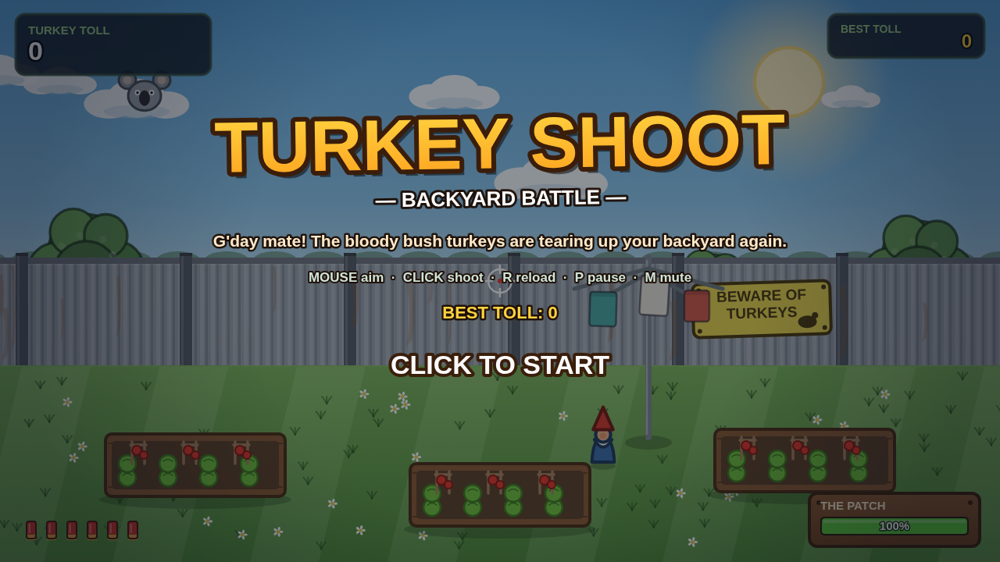
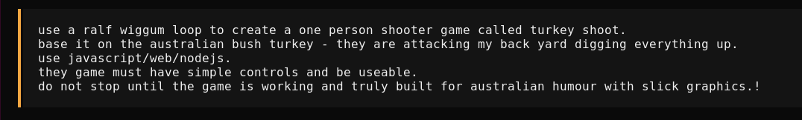

# TURKEY SHOOT — Backyard Battle

G'day mate! The bloody Australian bush turkeys are tearing up your backyard
again, digging everything to buggery. Grab the cork gun and defend the veggie
patch.



## How to play

| Input | Action |
|-------|--------|
| **Mouse** | Aim the crosshair |
| **Left click / tap** | Shoot (soft corks — family-friendly) |
| **R** or **Space** | Reload the 6-shell mag |
| **P** or **Esc** | Pause ("having a nap") |
| **M** | Mute |

### The rules of the backyard

- **Waves** of brush turkeys waddle and dart in from the fence line or burst
  out of dirt mounds. Each wave gets bigger and faster.
- If a turkey reaches a garden bed it starts **DIGGING** — mulch flies, plants
  cark it, and THE PATCH health bar drains. Let it hit 0% and your backyard
  is rooted. Game over.
- Every **5th wave, BIG BAZZA** shows up — a comically huge boss turkey who
  screams, shakes the screen and flings dirt at the camera. He takes about
  10 hits, but he's done like a dinner when he falls.
- **Power-ups** occasionally drop from shot turkeys (click them to collect):
  - 🌭 **Bunnings Snag** — instant reload + 6 bonus shells
  - 🍖 **Meat Tray** — +500 points
  - 🧙 **Garden Gnome** — repairs the patch +15%
- **Scoring**: 100 per turkey, +25% for mid-air shots, and combo multipliers
  (up to x5) for quick consecutive hits. Your best TURKEY TOLL is saved.



## Run it locally

```bash
npm start          # serves on http://localhost:8137
```

Then open <http://localhost:8137>. Works with mouse or basic touch.

## Play online

Once pushed, GitHub Actions deploys the game to **GitHub Pages** (see
`.github/workflows/deploy.yml`) — just enable *Settings → Pages → Source:
GitHub Actions* on the repo. Click, shoot, repeat.

## Under the bonnet

- Plain HTML/JS on HTML5 Canvas — zero runtime dependencies, all graphics
  and sounds procedurally generated (no asset files).
- Built by a Ralph Wiggum loop: requirements in [`PRD.md`](PRD.md), loop in
  [`ralph.sh`](ralph.sh), progress in [`progress.txt`](progress.txt).
- Tests: `node test.js` (smoke) and `npx playwright test` (visual + gameplay,
  screenshots in [`shots/`](shots)).

GLM-5.3-Flash used with this prompt to make this game.


